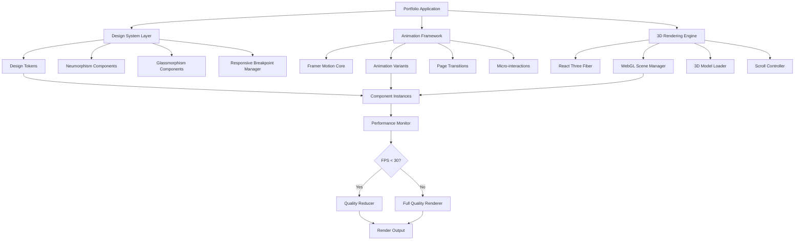

# Design Document: Modern Design System Redesign

## Overview

This design document specifies the technical architecture for redesigning the portfolio website with a modern design system that integrates Neumorphism, Glassmorphism, WebGL-powered 3D experiences, and Framer Motion animations. The system prioritizes performance, accessibility, and cross-browser compatibility while delivering a visually stunning and interactive user experience.

### Goals

1. **Visual Excellence**: Implement sophisticated design patterns (Neumorphism and Glassmorphism) that create depth, layering, and modern aesthetics
2. **Immersive Interaction**: Integrate WebGL 3D experiences with scroll-triggered animations and interactive models
3. **Animation Framework**: Establish Framer Motion as the single animation library with custom, reusable animation patterns
4. **Performance**: Maintain 60 FPS on capable devices and 30 FPS minimum across all interactions
5. **Accessibility**: Ensure WCAG 2.1 AA compliance with support for reduced motion preferences and keyboard navigation
6. **Consistency**: Create a centralized design token system for styles, spacing, shadows, and blur effects

### Technology Stack

- **Framework**: Next.js 16.1.6 with React 19.2.4 and TypeScript 5
- **3D Rendering**: Three.js 0.180.0 with @react-three/fiber 9.3.0 and @react-three/drei 10.7.4
- **Animation**: Framer Motion (motion 12.23.12)
- **Styling**: Tailwind CSS 3.4.1 with custom CSS properties for design tokens
- **Testing**: Vitest for unit tests, fast-check for property-based testing

### Key Architectural Decisions

1. **Design Token System**: All visual properties (colors, shadows, blur, spacing) defined as CSS custom properties and TypeScript constants to ensure consistency
2. **Component Library**: Reusable Neumorphism and Glassmorphism components with variants for different states (raised, pressed, layered)
3. **Animation Variants**: Centralized Framer Motion animation configurations that can be composed across components
4. **Performance Monitoring**: Real-time FPS tracking with automatic quality reduction when performance drops
5. **Progressive Enhancement**: Static fallbacks for WebGL content, reduced animations for prefers-reduced-motion
6. **Lazy Loading Strategy**: Defer heavy 3D assets and animation libraries until after initial page render


## Architecture

### System Architecture Diagram



### Layer Responsibilities

#### 1. Design System Layer

**Purpose**: Provides consistent styling primitives and components that implement Neumorphism and Glassmorphism patterns.

**Components**:
- `DesignTokens`: CSS custom properties and TypeScript constants for all visual primitives
- `NeumorphicCard`, `NeumorphicButton`: Components implementing neumorphic shadow patterns
- `GlassCard`, `GlassPanel`: Components implementing glassmorphism with backdrop blur
- `ResponsiveBreakpointProvider`: Context provider that tracks current breakpoint and adjusts styles

**Responsibilities**:
- Define and expose design tokens (colors, shadows, blur, spacing)
- Ensure contrast ratios meet WCAG requirements
- Adapt shadow and blur values based on viewport breakpoints
- Provide hover and active state transitions

#### 2. Animation Framework

**Purpose**: Manages all animations using Framer Motion exclusively, providing consistent timing and easing.

**Components**:
- `AnimationVariants`: Centralized animation configuration library
- `PageTransition`: Wrapper component for page entrance/exit animations
- `ScrollAnimationController`: Orchestrates scroll-triggered animations
- `MicroInteractionProvider`: Handles hover, click, focus animations

**Responsibilities**:
- Define reusable animation patterns (fade, slide, scale, rotate, stagger)
- Coordinate page transitions with Next.js routing
- Detect prefers-reduced-motion and disable animations accordingly
- Maintain 60 FPS during animations on capable devices


#### 3. 3D Rendering Engine

**Purpose**: Manages WebGL scenes, 3D models, and interactive visualizations.

**Components**:
- `WebGLSceneManager`: Initializes and manages Three.js scenes
- `ModelLoader`: Loads and caches 3D models (glTF/USD format)
- `ScrollSync3D`: Synchronizes 3D animations with scroll position
- `InteractiveModelController`: Handles user interactions (drag, pinch, hover)
- `ARPreviewManager`: Manages WebXR AR sessions

**Responsibilities**:
- Initialize WebGL context with fallback handling
- Implement LOD (Level of Detail) optimization
- Frustum culling and instancing for performance
- Coordinate scroll-triggered 3D animations
- Provide AR preview capabilities on supported devices

#### 4. Performance Monitor

**Purpose**: Tracks rendering performance and automatically adjusts quality settings.

**Components**:
- `FPSMonitor`: Tracks frame rate in real-time
- `QualityController`: Adjusts visual effects based on performance
- `ResourceLoader`: Lazy loads heavy assets after initial render

**Responsibilities**:
- Monitor FPS continuously
- Reduce particle effects, shadows, blur when FPS < 30
- Restore effects when FPS > 50 for sustained period
- Log performance metrics for diagnostics


## Components and Interfaces

### Design Token System

#### CSS Custom Properties

All design tokens will be defined as CSS custom properties in a global stylesheet:

```css
:root {
  /* Neumorphism Tokens */
  --neuro-light-source-angle: 145deg;
  --neuro-shadow-blur-min: 10px;
  --neuro-shadow-blur-max: 30px;
  --neuro-shadow-spread-min: -5px;
  --neuro-shadow-spread-max: 5px;
  --neuro-shadow-opacity: 0.15;
  --neuro-highlight-opacity: 0.1;
  --neuro-transition-hover: 200ms;
  --neuro-transition-active: 100ms;
  
  /* Glassmorphism Tokens */
  --glass-bg-opacity-min: 0.05;
  --glass-bg-opacity-max: 0.3;
  --glass-blur-min: 8px;
  --glass-blur-max: 24px;
  --glass-border-opacity: 0.2;
  --glass-shadow-blur: 30px;
  
  /* Responsive Breakpoints */
  --breakpoint-mobile: 768px;
  --breakpoint-tablet: 1024px;
  
  /* Spacing Scale (0-96px in 4px increments) */
  --space-0: 0;
  --space-1: 4px;
  --space-2: 8px;
  --space-3: 12px;
  --space-4: 16px;
  --space-6: 24px;
  --space-8: 32px;
  --space-12: 48px;
  --space-16: 64px;
  --space-24: 96px;
  
  /* Blur Radius Values */
  --blur-0: 0;
  --blur-1: 4px;
  --blur-2: 8px;
  --blur-3: 12px;
  --blur-4: 16px;
  --blur-5: 20px;
  --blur-6: 24px;
}
```


#### TypeScript Constants

```typescript
// lib/design-tokens.ts
export const designTokens = {
  neumorphism: {
    lightSourceAngle: 145,
    shadow: {
      blurMin: 10,
      blurMax: 30,
      spreadMin: -5,
      spreadMax: 5,
      opacity: 0.15,
    },
    highlight: {
      opacity: 0.1,
    },
    transition: {
      hover: 200,
      active: 100,
    },
  },
  glassmorphism: {
    background: {
      opacityMin: 0.05,
      opacityMax: 0.3,
    },
    blur: {
      min: 8,
      max: 24,
    },
    border: {
      opacity: 0.2,
    },
    shadow: {
      blur: 30,
    },
  },
  breakpoints: {
    mobile: 768,
    tablet: 1024,
  },
  spacing: [0, 4, 8, 12, 16, 24, 32, 48, 64, 96],
  blur: [0, 4, 8, 12, 16, 20, 24],
} as const;
```


### Neumorphism Component System

#### NeumorphicCard Component

```typescript
// components/design-system/NeumorphicCard.tsx
import { HTMLAttributes } from 'react';
import { motion } from 'framer-motion';

interface NeumorphicCardProps extends HTMLAttributes<HTMLDivElement> {
  variant?: 'raised' | 'pressed';
  interactive?: boolean;
}

export function NeumorphicCard({ 
  variant = 'raised', 
  interactive = false,
  children,
  className,
  ...props 
}: NeumorphicCardProps) {
  const baseStyles = {
    borderRadius: '16px',
    background: 'linear-gradient(145deg, hsl(0, 0%, 18%), hsl(0, 0%, 12%))',
  };

  const shadowStyles = {
    raised: {
      boxShadow: `
        -8px -8px 20px rgba(255, 255, 255, 0.1),
        8px 8px 20px rgba(0, 0, 0, 0.2)
      `,
    },
    pressed: {
      boxShadow: `
        inset 4px 4px 12px rgba(0, 0, 0, 0.2),
        inset -4px -4px 12px rgba(255, 255, 255, 0.05)
      `,
    },
  };

  return (
    <motion.div
      style={{ ...baseStyles, ...shadowStyles[variant] }}
      className={className}
      whileHover={interactive ? { scale: 1.02 } : undefined}
      whileTap={interactive ? { scale: 0.98 } : undefined}
      transition={{ duration: 0.2 }}
      {...props}
    >
      {children}
    </motion.div>
  );
}
```


### Glassmorphism Component System

#### GlassCard Component

```typescript
// components/design-system/GlassCard.tsx
import { HTMLAttributes } from 'react';
import { motion } from 'framer-motion';

interface GlassCardProps extends HTMLAttributes<HTMLDivElement> {
  blurStrength?: 'low' | 'medium' | 'high';
  zIndex?: number;
}

export function GlassCard({ 
  blurStrength = 'medium',
  zIndex = 10,
  children,
  className,
  ...props 
}: GlassCardProps) {
  const blurValues = {
    low: 8,
    medium: 16,
    high: 24,
  };

  const styles = {
    background: 'rgba(255, 255, 255, 0.1)',
    backdropFilter: `blur(${blurValues[blurStrength]}px)`,
    WebkitBackdropFilter: `blur(${blurValues[blurStrength]}px)`,
    border: '1px solid rgba(255, 255, 255, 0.2)',
    boxShadow: '0 8px 32px rgba(0, 0, 0, 0.1)',
    borderRadius: '16px',
    zIndex,
  };

  return (
    <motion.div
      style={styles}
      className={className}
      initial={{ opacity: 0, y: 20 }}
      animate={{ opacity: 1, y: 0 }}
      transition={{ duration: 0.6 }}
      {...props}
    >
      {children}
    </motion.div>
  );
}
```


### Responsive Design Manager

```typescript
// lib/responsive-manager.ts
import { createContext, useContext, useEffect, useState } from 'react';

type Breakpoint = 'mobile' | 'tablet' | 'desktop';

interface ResponsiveContextValue {
  breakpoint: Breakpoint;
  isTouch: boolean;
  prefersReducedMotion: boolean;
}

const ResponsiveContext = createContext<ResponsiveContextValue>({
  breakpoint: 'desktop',
  isTouch: false,
  prefersReducedMotion: false,
});

export function ResponsiveProvider({ children }: { children: React.ReactNode }) {
  const [breakpoint, setBreakpoint] = useState<Breakpoint>('desktop');
  const [isTouch, setIsTouch] = useState(false);
  const [prefersReducedMotion, setPrefersReducedMotion] = useState(false);

  useEffect(() => {
    const updateBreakpoint = () => {
      const width = window.innerWidth;
      if (width < 768) setBreakpoint('mobile');
      else if (width < 1024) setBreakpoint('tablet');
      else setBreakpoint('desktop');
    };

    const checkTouch = () => {
      setIsTouch(window.matchMedia('(pointer: coarse)').matches);
    };

    const checkMotion = () => {
      setPrefersReducedMotion(
        window.matchMedia('(prefers-reduced-motion: reduce)').matches
      );
    };

    updateBreakpoint();
    checkTouch();
    checkMotion();

    window.addEventListener('resize', updateBreakpoint);
    return () => window.removeEventListener('resize', updateBreakpoint);
  }, []);

  return (
    <ResponsiveContext.Provider value={{ breakpoint, isTouch, prefersReducedMotion }}>
      {children}
    </ResponsiveContext.Provider>
  );
}

export const useResponsive = () => useContext(ResponsiveContext);
```


### WebGL Scene Manager

```typescript
// lib/webgl/scene-manager.ts
import * as THREE from 'three';

export class WebGLSceneManager {
  private scene: THREE.Scene;
  private camera: THREE.PerspectiveCamera;
  private renderer: THREE.WebGLRenderer | null = null;
  private initialized = false;

  constructor() {
    this.scene = new THREE.Scene();
    this.camera = new THREE.PerspectiveCamera(75, 1, 0.1, 1000);
  }

  async initialize(canvas: HTMLCanvasElement): Promise<boolean> {
    try {
      const gl = canvas.getContext('webgl2') || canvas.getContext('webgl');
      if (!gl) {
        console.error('WebGL not supported');
        return false;
      }

      this.renderer = new THREE.WebGLRenderer({
        canvas,
        alpha: true,
        antialias: window.devicePixelRatio < 2,
      });

      this.renderer.setPixelRatio(Math.min(window.devicePixelRatio, 2));
      this.renderer.setSize(canvas.clientWidth, canvas.clientHeight);

      this.initialized = true;
      return true;
    } catch (error) {
      console.error('WebGL initialization failed:', error);
      return false;
    }
  }

  render() {
    if (this.renderer && this.initialized) {
      this.renderer.render(this.scene, this.camera);
    }
  }

  dispose() {
    this.renderer?.dispose();
    this.initialized = false;
  }

  getScene() {
    return this.scene;
  }

  getCamera() {
    return this.camera;
  }
}
```


### Animation Variants Library

```typescript
// lib/animation-variants.ts
import { Variants } from 'framer-motion';

export const animationVariants = {
  // Fade variants
  fadeIn: {
    initial: { opacity: 0 },
    animate: { opacity: 1 },
    exit: { opacity: 0 },
    transition: { duration: 0.6, ease: [0.42, 0, 0.58, 1] },
  },

  // Slide variants
  slideUp: {
    initial: { opacity: 0, y: 50 },
    animate: { opacity: 1, y: 0 },
    exit: { opacity: 0, y: -50 },
    transition: { duration: 0.8, ease: [0.22, 1, 0.36, 1] },
  },

  slideDown: {
    initial: { opacity: 0, y: -50 },
    animate: { opacity: 1, y: 0 },
    exit: { opacity: 0, y: 50 },
    transition: { duration: 0.8, ease: [0.22, 1, 0.36, 1] },
  },

  // Scale variants
  scaleIn: {
    initial: { opacity: 0, scale: 0.8 },
    animate: { opacity: 1, scale: 1 },
    exit: { opacity: 0, scale: 0.8 },
    transition: { duration: 0.5, ease: [0, 0, 0.2, 1] },
  },

  // Stagger container
  staggerContainer: {
    animate: {
      transition: {
        staggerChildren: 0.1,
        delayChildren: 0.2,
      },
    },
  },

  // Page transition
  pageTransition: {
    initial: { opacity: 0, x: -20 },
    animate: { opacity: 1, x: 0 },
    exit: { opacity: 0, x: 20 },
    transition: { duration: 0.4, ease: [0.4, 0, 0.2, 1] },
  },

  // Hover scale
  hoverScale: {
    whileHover: { scale: 1.05 },
    whileTap: { scale: 0.95 },
    transition: { type: 'spring', stiffness: 300, damping: 20 },
  },
} as const;
```


### Performance Monitor

```typescript
// lib/performance-monitor.ts
export class PerformanceMonitor {
  private fps = 60;
  private frames = 0;
  private lastTime = performance.now();
  private lowFPSStartTime: number | null = null;
  private highFPSStartTime: number | null = null;
  private qualityReduced = false;
  private callbacks: Set<(quality: 'full' | 'reduced') => void> = new Set();

  startMonitoring() {
    const measureFPS = () => {
      this.frames++;
      const currentTime = performance.now();
      const delta = currentTime - this.lastTime;

      if (delta >= 1000) {
        this.fps = Math.round((this.frames * 1000) / delta);
        this.frames = 0;
        this.lastTime = currentTime;

        this.checkQualityAdjustment();
      }

      requestAnimationFrame(measureFPS);
    };

    requestAnimationFrame(measureFPS);
  }

  private checkQualityAdjustment() {
    // Reduce quality if FPS < 30 for > 500ms
    if (this.fps < 30) {
      if (!this.lowFPSStartTime) {
        this.lowFPSStartTime = performance.now();
      } else if (performance.now() - this.lowFPSStartTime > 500 && !this.qualityReduced) {
        this.qualityReduced = true;
        this.notifyQualityChange('reduced');
      }
    } else {
      this.lowFPSStartTime = null;
    }

    // Restore quality if FPS > 50 for > 2s
    if (this.fps > 50 && this.qualityReduced) {
      if (!this.highFPSStartTime) {
        this.highFPSStartTime = performance.now();
      } else if (performance.now() - this.highFPSStartTime > 2000) {
        this.qualityReduced = false;
        this.highFPSStartTime = null;
        this.notifyQualityChange('full');
      }
    } else if (this.fps <= 50) {
      this.highFPSStartTime = null;
    }
  }

  onQualityChange(callback: (quality: 'full' | 'reduced') => void) {
    this.callbacks.add(callback);
    return () => this.callbacks.delete(callback);
  }

  private notifyQualityChange(quality: 'full' | 'reduced') {
    this.callbacks.forEach(cb => cb(quality));
  }

  getFPS() {
    return this.fps;
  }
}
```


## Data Models

### Design Token Configuration

```typescript
export interface NeumorphismToken {
  lightSourceAngle: number;
  shadow: {
    blurMin: number;
    blurMax: number;
    spreadMin: number;
    spreadMax: number;
    opacity: number;
  };
  highlight: {
    opacity: number;
  };
  transition: {
    hover: number; // milliseconds
    active: number; // milliseconds
  };
}

export interface GlassmorphismToken {
  background: {
    opacityMin: number;
    opacityMax: number;
  };
  blur: {
    min: number;
    max: number;
  };
  border: {
    opacity: number;
  };
  shadow: {
    blur: number;
  };
}

export interface DesignTokens {
  neumorphism: NeumorphismToken;
  glassmorphism: GlassmorphismToken;
  breakpoints: {
    mobile: number;
    tablet: number;
  };
  spacing: readonly number[];
  blur: readonly number[];
}
```


### WebGL Scene Configuration

```typescript
export interface WebGLSceneConfig {
  antialias: boolean;
  alpha: boolean;
  pixelRatio: number;
  frustumCulling: boolean;
  instancing: boolean;
  lodLevels: LODLevel[];
}

export interface LODLevel {
  distance: number;
  polygonCount: number;
  textureResolution: number;
}

export interface Interactive3DModel {
  id: string;
  modelPath: string;
  format: 'gltf' | 'usd';
  position: [number, number, number];
  rotation: [number, number, number];
  scale: [number, number, number];
  interactions: {
    hover: boolean;
    drag: boolean;
    pinch: boolean;
  };
  bounds: {
    minScale: number;
    maxScale: number;
  };
  arCapable: boolean;
}

export interface ScrollAnimation3D {
  modelId: string;
  startProgress: number; // 0-1
  endProgress: number; // 0-1
  properties: {
    position?: [number, number, number];
    rotation?: [number, number, number];
    scale?: [number, number, number];
    opacity?: number;
  };
  easing: 'linear' | 'easeIn' | 'easeOut' | 'easeInOut';
}
```


### Animation Configuration

```typescript
export interface AnimationVariant {
  initial: Record<string, any>;
  animate: Record<string, any>;
  exit?: Record<string, any>;
  transition: {
    duration: number;
    delay?: number;
    ease: number[] | string;
    type?: 'spring' | 'tween';
    stiffness?: number;
    damping?: number;
  };
}

export interface PageTransitionConfig {
  exitDuration: number; // milliseconds
  entranceDuration: number; // milliseconds
  totalDuration: number; // milliseconds
  interruptible: boolean;
  fallbackTimeout: number; // milliseconds
}

export interface MicroInteractionConfig {
  hover: {
    scale?: number;
    opacity?: number;
    colorShift?: number; // degrees
  };
  active: {
    duration: number;
    scale?: number;
  };
  spring: {
    stiffness: number;
    damping: number;
  };
}

export interface StaggerConfig {
  staggerChildren: number; // milliseconds
  delayChildren: number; // milliseconds
  direction: 'forward' | 'reverse';
}
```


## Correctness Properties

*A property is a characteristic or behavior that should hold true across all valid executions of a system—essentially, a formal statement about what the system should do. Properties serve as the bridge between human-readable specifications and machine-verifiable correctness guarantees.*

After analyzing all 15 requirements with 100+ acceptance criteria, I identified that this feature is **partially suitable** for property-based testing. The design system logic, animation configurations, and interaction calculations contain universal properties, while browser performance, WebGL rendering, and cross-browser compatibility require integration testing.

The following properties represent the core logical invariants that should hold across all valid inputs for the design system, animation framework, and interaction handling:

**Neumorphism & Glassmorphism properties** test style generation and contrast compliance  
**Animation configuration properties** verify timing, easing, and parameter constraints  
**Interaction calculation properties** validate rotation, scaling, and scroll mapping logic  
**Accessibility properties** ensure contrast ratios and keyboard navigation  
**Performance degradation properties** verify quality adjustment logic (using mocked FPS values)

Properties that test browser timing, FPS measurement, WebGL rendering, and cross-browser compatibility are classified as integration tests and excluded from this section.


### Property 1: Gradient Lightness Constraint

*For any* base color used in neumorphic components, the generated background gradient at 145-degree angle with color stops at 0%, 50%, and 100% SHALL have adjacent color stops that differ by no more than 10% in lightness value

**Validates: Requirements 1.4**

### Property 2: Neumorphism Consistency

*For any* neumorphic component instance, the component SHALL maintain light source angle of 145 degrees and shadow color opacity between 0.1 and 0.2

**Validates: Requirements 1.5**

### Property 3: Neumorphism Surface Contrast

*For any* neumorphic component configuration, the contrast ratio between component background and adjacent surfaces SHALL be at least 1.5:1 for depth perception

**Validates: Requirements 1.8**

### Property 4: Neumorphism Text Contrast

*For any* text or icon placed on a neumorphic component, the contrast ratio between foreground content and background SHALL be at least 4.5:1

**Validates: Requirements 1.9**

### Property 5: Glassmorphism Layering

*For any* glassmorphism component in a layout, z-index values SHALL be assigned in increments of 10 and shadow blur radius SHALL be between 20px and 40px

**Validates: Requirements 2.3**


### Property 6: Glassmorphism Text Contrast

*For any* text size placed on a glassmorphism component, the contrast ratio SHALL be at least 4.5:1 for text smaller than 18pt and at least 3:1 for text 18pt or larger against the blurred background

**Validates: Requirements 2.4**

### Property 7: Dynamic Opacity Adjustment

*For any* background luminance value behind a glassmorphism component, when luminance is below 0.3, the component background opacity SHALL be increased to maintain minimum 4.5:1 text contrast

**Validates: Requirements 2.5**

### Property 8: Responsive Text Proportion

*For any* text configuration, heading-to-body text size ratios SHALL remain within 10% variance and spacing proportions within 15% variance across mobile (< 768px), tablet (768-1024px), and desktop (≥ 1024px) breakpoints

**Validates: Requirements 3.4**

### Property 9: Touch Target Sizing

*For any* interactive element on a device with pointer: coarse, the element SHALL have minimum touch target size of 44x44 pixels

**Validates: Requirements 3.6**

### Property 10: Touch Device Hover Disable

*For any* device configuration reporting pointer: coarse and hover: none, hover-specific effects SHALL be disabled and alternative feedback SHALL be provided for interactions

**Validates: Requirements 3.10**


### Property 11: LOD Optimization Trigger

*For any* simulated FPS scenario where frame rate drops below 30 FPS for more than 500 milliseconds, the WebGL scene SHALL reduce polygon count or texture resolution through LOD optimization

**Validates: Requirements 4.5**

### Property 12: WebGL Fallback Handling

*For any* WebGL initialization failure scenario, the website SHALL display a static image or video fallback that conveys the same visual information as the 3D content

**Validates: Requirements 4.6**

### Property 13: WebGL Timeout Fallback

*For any* WebGL initialization timeout scenario exceeding 5000 milliseconds, the website SHALL automatically display fallback content and log an error message

**Validates: Requirements 4.8**

### Property 14: Scroll-to-Progress Mapping

*For any* scroll position value, the WebGL scene SHALL map scroll position to animation progress linearly, where 0% progress corresponds to element entering viewport and 100% progress corresponds to element exiting viewport

**Validates: Requirements 5.2**

### Property 15: Performance Degradation on FPS Drop

*For any* simulated scenario where scroll animation frame rate drops below 30 FPS for more than 500 milliseconds, the WebGL scene SHALL reduce particle count by 50% and disable secondary animation effects

**Validates: Requirements 5.6**


### Property 16: Performance Recovery

*For any* simulated scenario where FPS recovers to 50 or higher for 2 seconds, the WebGL scene SHALL restore full animation complexity

**Validates: Requirements 5.7**

### Property 17: Drag Rotation Rate

*For any* drag distance on an interactive 3D model, the model SHALL rotate proportionally at a rate between 0.5 and 2.0 degrees per pixel

**Validates: Requirements 6.2**

### Property 18: Pinch Scale Bounds

*For any* pinch gesture distance on touch devices, the interactive 3D model SHALL scale between 0.5x and 3.0x of original size proportional to pinch distance

**Validates: Requirements 6.3**

### Property 19: Scale Boundary Enforcement

*For any* scale attempt on an interactive 3D model beyond 0.5x minimum or 3.0x maximum, the model SHALL stop scaling and provide haptic or visual feedback indicating the boundary

**Validates: Requirements 6.4**

### Property 20: Interaction Indicator Presence

*For any* interactive 3D model, the scene SHALL display persistent visual indicators (rotation arrows, hand cursor, or instructional overlay) to communicate available interactions

**Validates: Requirements 6.6**


### Property 21: Unsupported Input Method Messaging

*For any* unsupported input method (mouse, touch, keyboard) for a specific interactive 3D model, the website SHALL display a message indicating alternative interaction methods

**Validates: Requirements 6.7**

### Property 22: AR Scale Ratio

*For any* 3D model displayed in AR mode, the model SHALL maintain a 1:1 scale ratio where 1 unit in the 3D model corresponds to 1 meter in real-world space

**Validates: Requirements 7.4**

### Property 23: WebXR Initialization Error Handling

*For any* WebXR session initialization failure, the website SHALL display an error message "AR not available on this device" and return to normal 3D view

**Validates: Requirements 7.6**

### Property 24: Animation Completion Callbacks

*For any* animation completion event, the Framer Motion animation SHALL invoke the onAnimationComplete callback function for coordinating sequential actions

**Validates: Requirements 8.6**

### Property 25: Animation Duration Constraints

*For any* animation definition, the Framer Motion animation SHALL have duration between 0.3 and 2.0 seconds and use custom cubic-bezier or spring timing functions

**Validates: Requirements 9.2**


### Property 26: Explicit Easing Definition

*For any* animation easing configuration, the easing curve SHALL use explicitly defined control points (e.g., [0.42, 0, 0.58, 1]) rather than string presets

**Validates: Requirements 9.4**

### Property 27: Stagger Delay Constraints

*For any* stagger animation involving multiple elements, the delay between consecutive element animations SHALL be between 50 and 300 milliseconds

**Validates: Requirements 9.6**

### Property 28: Transition Interruption Handling

*For any* page transition interruption scenario where user initiates new navigation during ongoing transition, the animation framework SHALL interrupt current animation and begin new transition within 50 milliseconds

**Validates: Requirements 10.6**

### Property 29: Animation Timeout Fallback

*For any* animation timeout scenario where exit or entrance animation fails to complete within 500 milliseconds, the animation framework SHALL skip the remaining animation and proceed with page transition

**Validates: Requirements 10.7**

### Property 30: Hover Effect Constraints

*For any* hover interaction on an interactive element, the Framer Motion animation SHALL apply scale change between 0.95x and 1.1x, opacity change between 0.7 and 1.0, or color transition with hue shift up to 15 degrees

**Validates: Requirements 11.2**


### Property 31: Spring Physics Constraints

*For any* interactive element animation using spring physics, the spring SHALL have stiffness between 200 and 400 and damping between 15 and 30

**Validates: Requirements 11.5**

### Property 32: Touch Input Hover Disable

*For any* device reporting pointer: coarse (touch input), the animation framework SHALL not apply hover-triggered animations

**Validates: Requirements 11.6**

### Property 33: Animation Failure Recovery

*For any* animation failure scenario where animation fails to complete within its specified duration, the animation framework SHALL immediately jump to the end state and log a warning

**Validates: Requirements 11.7**

### Property 34: Component Token Usage

*For any* component created or updated in the design system, the component SHALL apply styles using exclusively design system tokens without hardcoded color, spacing, shadow, or blur values

**Validates: Requirements 12.3**

### Property 35: Invalid Token Error Handling

*For any* component reference to a design system token that does not exist, the design system SHALL log an error and apply a fallback default value

**Validates: Requirements 12.4**


### Property 36: Asset Lazy Loading

*For any* WebGL scene or animation asset larger than 500 kilobytes, the design system SHALL defer loading until 3 seconds after initial page render

**Validates: Requirements 13.2**

### Property 37: GPU-Accelerated Properties

*For any* Framer Motion animation, the animation SHALL use GPU-accelerated CSS properties (transform, opacity) instead of CPU-bound properties (top, left, width, height)

**Validates: Requirements 13.3**

### Property 38: Performance Degradation

*For any* simulated scenario where frame rate drops below 30 FPS for more than 500 milliseconds, the website SHALL disable particle effects and reduce render distance by 50%

**Validates: Requirements 13.4**

### Property 39: Effect Restoration

*For any* simulated scenario where frame rate recovers to 50 FPS or higher for 1 second, the website SHALL restore disabled visual effects

**Validates: Requirements 13.5**

### Property 40: Shadow Optimization

*For any* layout configuration, when more than 10 shadow elements are visible, the design system SHALL optimize box-shadow by reducing blur radius by 30%

**Validates: Requirements 13.7**


### Property 41: Performance Metrics Logging

*For any* performance metric measurement that fails to meet Core Web Vitals thresholds, the website SHALL log performance metrics for diagnostic purposes

**Validates: Requirements 13.9**

### Property 42: Text Contrast Compliance

*For any* text configuration in neumorphic or glassmorphic components, text SHALL maintain contrast ratio of at least 4.5:1 for text smaller than 18pt and at least 3:1 for text 18pt or larger

**Validates: Requirements 14.1**

### Property 43: Reduced Motion Compliance

*For any* animation configuration when prefers-reduced-motion is enabled, the animation framework SHALL disable all animations that involve motion paths, scaling, or rotation

**Validates: Requirements 14.2**

### Property 44: Keyboard Navigation Support

*For any* interactive 3D model, the model SHALL support Tab key to enter/exit 3D controls, Arrow keys for rotation, Plus/Minus keys for zoom, and Escape key to return focus to main content

**Validates: Requirements 14.3**

### Property 45: WebGL Fallback Content

*For any* WebGL scene failure scenario, the website SHALL display a text-based description of the 3D content with equivalent information

**Validates: Requirements 14.4**


### Property 46: ARIA Label Presence

*For any* WebGL scene or custom interactive element that lacks visible text labels, the website SHALL provide ARIA labels describing the purpose

**Validates: Requirements 14.5**

### Property 47: Focus Indicator Specifications

*For any* focused element, the design system SHALL display a focus indicator with minimum 2px border width and contrast ratio of at least 3:1 against adjacent colors

**Validates: Requirements 14.6**

### Property 48: Focus Trap for 3D Controls

*For any* keyboard navigation into an interactive 3D model, the website SHALL trap focus within 3D controls until user presses Escape key

**Validates: Requirements 14.7**

### Property 49: WebGL Detection

*For any* environment configuration, the WebGL scene SHALL correctly detect WebGL support before attempting to render 3D content

**Validates: Requirements 15.4**

### Property 50: WebGL Conditional Rendering

*For any* environment where WebGL 1.0 or higher is available, the WebGL scene SHALL render 3D content; where unavailable, the website SHALL display a static fallback image

**Validates: Requirements 15.5, 15.6**


### Property 51: Graceful CSS Degradation

*For any* unavailable browser-specific CSS feature, the design system SHALL render content without visual effects while maintaining layout structure and readability

**Validates: Requirements 15.7**


## Error Handling

### WebGL Initialization Failures

**Scenario**: WebGL is not supported or initialization fails

**Handling**:
1. Detect WebGL support before attempting to initialize
2. If WebGL context creation fails, log error to console
3. Display static fallback image or video in place of 3D content
4. Show user-friendly message: "Your browser does not support 3D content. Showing static preview."
5. Ensure fallback content conveys the same information as 3D visualization

**Code Example**:
```typescript
try {
  const gl = canvas.getContext('webgl2') || canvas.getContext('webgl');
  if (!gl) {
    throw new Error('WebGL not supported');
  }
  // Initialize scene
} catch (error) {
  console.error('WebGL initialization failed:', error);
  showFallbackContent();
  showUserMessage('Your browser does not support 3D content');
}
```


### WebXR AR Session Failures

**Scenario**: AR preview fails to initialize or camera permission is denied

**Handling**:
1. Check device support for WebXR 'immersive-ar' mode before showing AR button
2. If session initialization fails, display: "AR not available on this device"
3. If camera permission denied, display: "Camera access required for AR"
4. Disable AR preview button after permission denial
5. Automatically return to normal 3D view

**Code Example**:
```typescript
if ('xr' in navigator && await navigator.xr.isSessionSupported('immersive-ar')) {
  showARButton();
} else {
  hideARButton();
}

try {
  const session = await navigator.xr.requestSession('immersive-ar');
} catch (error) {
  if (error.name === 'NotAllowedError') {
    showMessage('Camera access required for AR');
    disableARButton();
  } else {
    showMessage('AR not available on this device');
    returnToNormal3DView();
  }
}
```


### Performance Degradation

**Scenario**: Frame rate drops below acceptable thresholds

**Handling**:
1. Monitor FPS continuously using PerformanceMonitor class
2. If FPS < 30 for > 500ms:
   - Reduce particle count by 50%
   - Disable secondary animation effects
   - Reduce render distance by 50%
   - Reduce shadow blur radius by 30% when > 10 shadows visible
3. If FPS recovers to > 50 for sustained period (1-2 seconds):
   - Restore particle effects
   - Re-enable animation complexity
   - Restore full render distance
4. Log performance metrics for diagnostics

**Code Example**:
```typescript
performanceMonitor.onQualityChange((quality) => {
  if (quality === 'reduced') {
    scene.particleCount *= 0.5;
    scene.disableSecondaryEffects();
    scene.renderDistance *= 0.5;
  } else {
    scene.restoreFullQuality();
  }
});
```


### Animation Timeout and Failures

**Scenario**: Animations fail to complete within expected duration

**Handling**:
1. Set timeout for each animation phase (exit: 500ms, entrance: 500ms)
2. If animation exceeds timeout, force jump to end state
3. Log warning with animation details
4. Continue with page transition to avoid blocking user
5. For page transitions, allow interruption by new navigation within 50ms

**Code Example**:
```typescript
const animationTimeout = setTimeout(() => {
  console.warn('Animation timeout exceeded, jumping to end state');
  controls.set(animationEndState);
  onComplete();
}, 500);

animation.onComplete(() => {
  clearTimeout(animationTimeout);
  onComplete();
});
```

### Invalid Design Token References

**Scenario**: Component references a non-existent design token

**Handling**:
1. Detect missing token reference
2. Log error with token name and component details
3. Apply fallback default value (e.g., 0 for spacing, transparent for colors)
4. Continue rendering to avoid breaking the page
5. In development, throw warning to aid debugging

**Code Example**:
```typescript
function getToken(tokenName: string): any {
  if (!(tokenName in designTokens)) {
    console.error(`Invalid token reference: ${tokenName}`);
    return getFallbackValue(tokenName);
  }
  return designTokens[tokenName];
}
```


### Contrast Ratio Violations

**Scenario**: Generated styles result in insufficient contrast ratios

**Handling**:
1. Validate contrast ratios during style generation
2. For neumorphism: Ensure 1.5:1 for surfaces, 4.5:1 for text
3. For glassmorphism: Dynamically adjust opacity when background luminance < 0.3
4. Log warning if contrast cannot be achieved
5. Fall back to high-contrast mode if adjustments insufficient

**Code Example**:
```typescript
function adjustGlassOpacity(backgroundLuminance: number, textColor: string): number {
  let opacity = 0.1;
  
  while (calculateContrast(textColor, opacity, backgroundLuminance) < 4.5) {
    opacity += 0.05;
    if (opacity > 0.3) break;
  }
  
  if (calculateContrast(textColor, opacity, backgroundLuminance) < 4.5) {
    console.warn('Cannot achieve 4.5:1 contrast, using high-contrast fallback');
    return 0.5; // Fallback to higher opacity
  }
  
  return opacity;
}
```


## Testing Strategy

### Overview

This feature requires a **dual testing approach** combining unit tests with property-based tests, plus integration tests for browser-specific behaviors.

**Testing Framework**: Vitest for unit and integration tests
**Property-Based Testing Library**: fast-check for JavaScript/TypeScript
**Property Test Configuration**: Minimum 100 iterations per property test due to randomization

### Unit Tests

Unit tests focus on specific examples, edge cases, and integration points:

**Design System Components**:
- Test NeumorphicCard renders with raised and pressed variants
- Test GlassCard applies correct blur values for low/medium/high strength
- Test ResponsiveProvider correctly detects mobile/tablet/desktop breakpoints
- Test design token values are defined correctly

**Animation System**:
- Test animation variants have correct duration and easing
- Test page transition coordinates exit and entrance animations
- Test stagger container applies correct delays
- Test prefers-reduced-motion disables motion animations
- Test animation interruption during page transitions

**WebGL Integration**:
- Test WebGLSceneManager initializes successfully with valid canvas
- Test fallback content displays when WebGL unavailable
- Test AR button shows/hides based on WebXR support
- Test 3D model loader handles glTF and USD formats

**Performance Monitor**:
- Test FPS tracking updates correctly
- Test quality reduction triggers after sustained low FPS
- Test quality restoration after FPS recovery


### Property-Based Tests

Property tests verify universal properties across randomized inputs. Each property test must:
- Run minimum 100 iterations
- Reference the design document property number
- Use comment tag: `// Feature: modern-design-system-redesign, Property {N}: {property_text}`

**Example Property Test**:
```typescript
import fc from 'fast-check';
import { describe, it, expect } from 'vitest';

describe('Design System - Neumorphism', () => {
  // Feature: modern-design-system-redesign, Property 1: Gradient Lightness Constraint
  it('should generate gradients with adjacent color stops differing by ≤10% lightness', () => {
    fc.assert(
      fc.property(
        fc.integer({ min: 0, max: 360 }), // hue
        fc.float({ min: 0, max: 1 }), // saturation
        fc.float({ min: 0, max: 1 }), // lightness
        (h, s, l) => {
          const gradient = generateNeumorphicGradient({ h, s, l });
          const stops = gradient.colorStops;
          
          for (let i = 1; i < stops.length; i++) {
            const prevLightness = stops[i - 1].lightness;
            const currLightness = stops[i].lightness;
            const diff = Math.abs(currLightness - prevLightness);
            
            expect(diff).toBeLessThanOrEqual(0.1);
          }
        }
      ),
      { numRuns: 100 }
    );
  });

  // Feature: modern-design-system-redesign, Property 4: Neumorphism Text Contrast
  it('should maintain 4.5:1 contrast ratio for text on neumorphic backgrounds', () => {
    fc.assert(
      fc.property(
        fc.record({
          textColor: fc.hexaString({ minLength: 6, maxLength: 6 }),
          bgColor: fc.hexaString({ minLength: 6, maxLength: 6 }),
        }),
        ({ textColor, bgColor }) => {
          const contrast = calculateContrastRatio(textColor, bgColor);
          expect(contrast).toBeGreaterThanOrEqual(4.5);
        }
      ),
      { numRuns: 100 }
    );
  });
});
```


**Property Test Categories**:

1. **Contrast and Accessibility** (Properties 3, 4, 6, 7, 42, 47):
   - Generate random color combinations
   - Verify contrast ratios meet WCAG requirements
   - Test dynamic opacity adjustments

2. **Animation Constraints** (Properties 25, 26, 27, 30, 31):
   - Generate random animation configurations
   - Verify duration, easing, stagger delays within specified bounds
   - Test spring physics parameters

3. **Interaction Calculations** (Properties 14, 17, 18, 19, 22):
   - Generate random drag distances, pinch gestures, scroll positions
   - Verify rotation rates, scale bounds, progress mapping
   - Test AR scale ratio calculations

4. **Performance Logic** (Properties 11, 15, 16, 38, 39, 40):
   - Mock FPS values and simulate drops/recoveries
   - Verify quality reduction and restoration logic
   - Test optimization triggers

5. **Error Handling** (Properties 12, 13, 23, 29, 33, 35, 45):
   - Generate failure scenarios
   - Verify fallback content, error logging, timeout handling
   - Test graceful degradation

6. **Configuration Validation** (Properties 34, 37, 43, 49, 51):
   - Generate component configurations
   - Verify token usage, GPU properties, motion preferences
   - Test feature detection logic


### Integration Tests

Integration tests verify browser-specific behaviors that cannot be tested with property-based testing:

**Performance Measurements**:
- Measure DOMContentLoaded timing (Requirement 13.1)
- Measure WebGL initialization time (Requirement 4.2)
- Track FPS during rendering and animations (Requirements 4.3, 5.3, 9.3, 10.4, 11.1)
- Measure scroll animation response time (Requirement 5.1)
- Measure Core Web Vitals: LCP, CLS (Requirement 13.8)

**Browser Interaction Tests**:
- Test page transition timing in Next.js routing (Requirements 10.1-10.5)
- Test hover and click micro-interactions (Requirement 11.4)
- Test breakpoint transitions and CLS (Requirements 3.7, 3.8, 3.9)
- Test touch gestures on mobile devices (Requirement 3.5)

**WebGL and AR Tests**:
- Test WebGL scene initialization in real browser context
- Test AR session initialization with WebXR API (Requirement 7.2)
- Test 3D model loading and rendering performance
- Verify camera permission handling

**Cross-Browser Compatibility**:
- Test rendering consistency across Chrome, Firefox, Safari, Edge (Requirements 15.1-15.3)
- Test vendor prefix application (Requirement 15.8)
- Visual regression testing for layout and color variance (Requirement 15.9)

### Test Organization

```
tests/
├── unit/
│   ├── design-system/
│   │   ├── neumorphic-card.test.ts
│   │   ├── glass-card.test.ts
│   │   ├── design-tokens.test.ts
│   │   └── responsive-manager.test.ts
│   ├── animation/
│   │   ├── animation-variants.test.ts
│   │   ├── page-transition.test.ts
│   │   └── micro-interactions.test.ts
│   ├── webgl/
│   │   ├── scene-manager.test.ts
│   │   ├── model-loader.test.ts
│   │   └── ar-manager.test.ts
│   └── performance/
│       └── performance-monitor.test.ts
├── property/
│   ├── contrast.property.test.ts
│   ├── animations.property.test.ts
│   ├── interactions.property.test.ts
│   ├── performance.property.test.ts
│   └── error-handling.property.test.ts
└── integration/
    ├── performance-metrics.integration.test.ts
    ├── page-transitions.integration.test.ts
    ├── webgl-rendering.integration.test.ts
    └── cross-browser.integration.test.ts
```


### Testing Priorities

**High Priority** (Core Functionality):
1. Contrast ratio compliance (Properties 3, 4, 6, 7, 42)
2. WebGL fallback handling (Properties 12, 13, 45)
3. Performance degradation and recovery (Properties 11, 15, 16, 38, 39)
4. Animation constraints and error handling (Properties 25, 29, 33)
5. Accessibility features (Properties 43, 44, 46, 47, 48)

**Medium Priority** (User Experience):
1. Interaction calculations (Properties 17, 18, 19)
2. Responsive behavior (Properties 8, 9, 10)
3. Micro-interaction effects (Properties 30, 31, 32)
4. Token system and consistency (Properties 34, 35)

**Lower Priority** (Edge Cases):
1. AR-specific features (Properties 22, 23)
2. Advanced animation choreography (Properties 26, 27)
3. Browser-specific optimizations (Property 51)

### Test Coverage Goals

- **Unit Tests**: 80% code coverage for design system and animation framework
- **Property Tests**: All 51 properties implemented with 100+ iterations each
- **Integration Tests**: Cover all browser performance requirements and cross-browser scenarios
- **Total Coverage**: Aim for 85%+ overall test coverage

### Continuous Integration

- Run unit and property tests on every commit
- Run integration tests on pull requests
- Run cross-browser tests weekly
- Monitor Core Web Vitals in production

